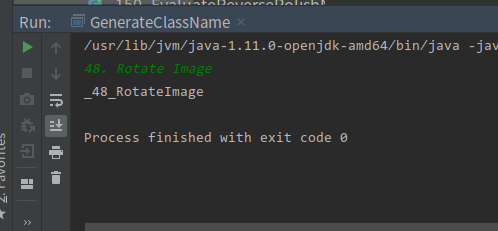

# LeetCode
该项目是 LeetCode 上的题解。

`src/easy/`路径下都是难度为 easy 的题目，`src/medium/`路径下都是难度为 medium 的题目，`src/hard/`路径下都是难度为 hard 的题目。这三个路径下的每一个类都是一道题目的答案，有的类里面会有多个方法，对应着题目的不同解法。类名的命名规则是`_题号_题目名称`。

`src/util/`路径下是解题时经常用到的辅助类，其中有一个类 GenerateClassName 可以按照上述命名规则生成类名。

例如，我如果想添加第 48 题的答案，第 48 题的题目如下：

```
48. Rotate Image
```

我就可以直接运行 GenerateClassName 里面的 main 方法，然后把第 48 题的题目复制到控制台，然后回车，就自动生成了 `_48_RotateImage`这个类名。运行效果如下图所示：



把这个类名复制一下，新建类的时候直接把类名粘贴过去就可以了。

