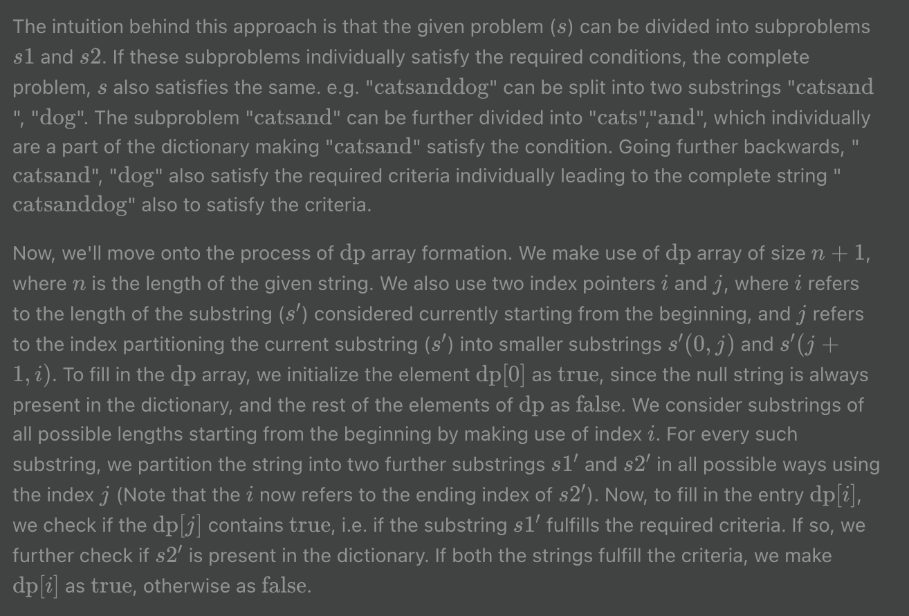

[TOC]

## Video Solution
---

<div class='video-preview'></div>

<div>&nbsp;
</div>

## Solution Article

---

#### Approach 1: Brute Force

**Algorithm**

The naive approach to solve this problem is to use recursion and backtracking.
For finding the solution, we check every possible prefix of that string in the dictionary of words, if it is found in the dictionary, then the recursive function is called for the remaining portion of that string. And, if in some function call it is found that the complete string is in dictionary, then it will return true.

```
class Solution {
public:
    bool wordBreak(string s, vector<string>& wordDict) {
        set<string> word_set(wordDict.begin(), wordDict.end());
        return wordBreakRecur(s, word_set, 0);
    }

    bool wordBreakRecur(string& s, set<string>& word_set, int start) {
        if (start == s.length()) {
            return true;
        }
        for (int end = start + 1; end <= s.length(); end++) {
            if (word_set.find(s.substr(start, end - start)) != word_set.end() and
                wordBreakRecur(s, word_set, end)) {
                return true;
            }
        }
        return false;
    }
};
```

**Complexity Analysis**

*n* is the length of the input string.

* Time complexity : *O(2^n)*.
Given a string of length *n*, there are *n + 1* ways to split it into two parts.
At each step, we have a choice: to split or not to split.
In the worse case, when all choices are to be checked, that results in *O(2^n)*.

* Space complexity : *O(n)*. The depth of the recursion tree can go upto *n*.

<br />

---

#### Approach 2: Recursion with memoization

**Algorithm**

In the previous approach we can see that many subproblems were redundant, i.e we were calling the recursive function multiple times for a particular string. To avoid this we can use memoization method, where an array *memo* is used to store the result of the subproblems. Now, when the function is called again for a particular string, value will be fetched and returned using the *memo* array, if its value has been already evaluated.

With memoization many redundant subproblems are avoided and recursion tree is pruned and thus it reduces the time complexity by a large factor.

```
class Solution {
public:
    bool wordBreak(string s, vector<string>& wordDict) {
        set<string> word_set(wordDict.begin(), wordDict.end());
        // In the memo table, -1 stands for the state not yet reached,
        // 0 for false and 1 for true
        vector<int> memo(s.length(), -1);
        return wordBreakMemo(s, word_set, 0, memo);
    }

    bool wordBreakMemo(string& s, set<string>& word_set, int start, vector<int>& memo) {
        if (start == s.length()) {
            return true;
        }
        if (memo[start] != -1) {
            return memo[start];
        }
        for (int end = start + 1; end <= s.length(); end++) {
            if (word_set.find(s.substr(start, end - start)) != word_set.end() and
                wordBreakMemo(s, word_set, end, memo)) {
                return memo[start] = true;
            }
        }
        return memo[start] = false;
    }
};
```

**Complexity Analysis**

*n* is the length of the input string.

* Time complexity : $O(n^3)$. Size of recursion tree can go up to $n^2$.
* Space complexity : $O(n)$. The depth of recursion tree can go up to *n*.


#### Approach 3: Using Breadth-First-Search

**Algorithm**

Another approach is to use Breadth-First-Search. Visualize the string as a tree where each node represents the prefix upto index *end*.
Two nodes are connected only if the substring between the indices linked with those nodes is also a valid string which is present in the dictionary.
In order to form such a tree, we start with the first character of the given string (say *s*) which acts as the root of the tree being formed and find every possible substring starting with that character which is a part of the dictionary. Further, the ending index (say *i*) of every such substring is pushed at the back of a queue which will be used for Breadth First Search. Now, we pop an element out from the front of the queue and perform the same process considering the string *s(i+1,end)* to be the original string and the popped node as the root of the tree this time. This process is continued, for all the nodes appended in the queue during the course of the process. If we are able to obtain the last element of the given string as a node (leaf) of the tree, this implies that the given string can be partitioned into substrings which are all a part of the given dictionary.

The formation of the tree can be better understood with this example:
<!---->
              

```java
public class Solution {
    public boolean wordBreak(String s, List<String> wordDict) {
        Set<String> wordDictSet = new HashSet<>(wordDict);
        Queue<Integer> queue = new LinkedList<>();
        boolean[] visited = new boolean[s.length()];
        queue.add(0);
        while (!queue.isEmpty()) {
            int start = queue.remove();
            if (visited[start]) {
                continue;
            }
            for (int end = start + 1; end <= s.length(); end++) {
                if (wordDictSet.contains(s.substring(start, end))) {
                    queue.add(end);
                    if (end == s.length()) {
                        return true;
                    }
                }
            }
            visited[start] = true;
        }
        return false;
    }
}
```

**Complexity Analysis**

*n* is the length of the input string.

- Time complexity : $O(n^3)$. For every starting index, the search can continue till the end of the given string.
- Space complexity : $O(n)$. Queue of at most $n$ size is needed.

---

#### Approach 4: Using Dynamic Programming

**Algorithm**



The intuition behind this approach is that the given problem (s*s*) can be divided into subproblems s1*s*1 and s2*s*2. If these subproblems individually satisfy the required conditions, the complete problem, s*s* also satisfies the same. e.g. "\text{catsanddog}catsanddog" can be split into two substrings "\text{catsand}catsand", "\text{dog}dog". The subproblem "\text{catsand}catsand" can be further divided into "\text{cats}cats","\text{and}and", which individually are a part of the dictionary making "\text{catsand}catsand" satisfy the condition. Going further backwards, "\text{catsand}catsand", "\text{dog}dog" also satisfy the required criteria individually leading to the complete string "\text{catsanddog}catsanddog" also to satisfy the criteria.

Now, we'll move onto the process of \text{dp}dp array formation. We make use of \text{dp}dp array of size n+1*n*+1, where n*n* is the length of the given string. We also use two index pointers i*i* and j*j*, where i*i* refers to the length of the substring (s'*s*′) considered currently starting from the beginning, and j*j* refers to the index partitioning the current substring (s'*s*′) into smaller substrings s'(0,j)*s*′(0,*j*) and s'(j+1,i)*s*′(*j*+1,*i*). To fill in the \text{dp}dp array, we initialize the element \text{dp}[0]dp[0] as \text{true}true, since the null string is always present in the dictionary, and the rest of the elements of \text{dp}dp as \text{false}false. We consider substrings of all possible lengths starting from the beginning by making use of index i*i*. For every such substring, we partition the string into two further substrings s1'*s*1′ and s2'*s*2′ in all possible ways using the index j*j* (Note that the i*i* now refers to the ending index of s2'*s*2′). Now, to fill in the entry \text{dp}[i]dp[*i*], we check if the \text{dp}[j]dp[*j*] contains \text{true}true, i.e. if the substring s1'*s*1′ fulfills the required criteria. If so, we further check if s2'*s*2′ is present in the dictionary. If both the strings fulfill the criteria, we make \text{dp}[i]dp[*i*] as \text{true}true, otherwise as \text{false}false.

```java
public class Solution {
    public boolean wordBreak(String s, List<String> wordDict) {
        Set<String> wordDictSet = new HashSet<>(wordDict);
        boolean[] dp = new boolean[s.length() + 1];
        dp[0] = true;
        for (int i = 1; i <= s.length(); i++) {
            for (int j = 0; j < i; j++) {
                if (dp[j] && wordDictSet.contains(s.substring(j, i))) {
                    dp[i] = true;
                    break;
                }
            }
        }
        return dp[s.length()];
    }
}
```

```java
// 最快
class Solution {
    private Boolean[] dp;

    private boolean recursion(String s, int pos, List<String> wordDict) {
        if (pos == s.length()) return true;
        else if (dp[pos] != null) return dp[pos];
        
        int sLength = s.length();

        for (String word : wordDict){
            if (sLength - pos >= word.length()) {
                int wordLength = word.length();
                boolean match = true;

                for (int i = 0; i < wordLength; i++)
                    if (s.charAt(pos + i) != word.charAt(i)) {
                        match = false;
                        break;
                    }

                if (match && recursion(s, pos + wordLength, wordDict))
                    return dp[pos] = true;
            }
        }

        return dp[pos] = false;
    }

    public boolean wordBreak(String s, List<String> wordDict) {
        dp = new Boolean[s.length()];
        return recursion(s, 0, wordDict);
    }
}
```


**Complexity Analysis**

*n* is the length of the input string.

* Time complexity : *O(n^3)*. There are two nested loops,
and substring computation at each iteration. Overall that results in *O(n^3)*
time complexity.

* Space complexity : *O(n)*. Length of *p* array is *n+1*.